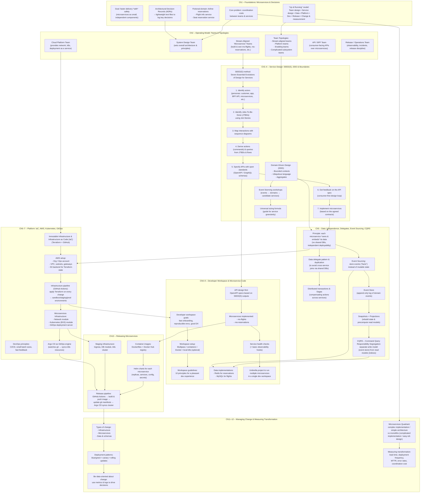

# Microservices: Up and Running — Team Summary & Practical Playbook

This README is a **resume** of the book *Microservices: Up and Running* (Ronnie Mitra, Irakli Nadareishvili).

---

## Why microservices (the “real” reason)

Microservices are not a fashion statement. They’re a strategy to **reduce coordination costs** in complex systems:
- Less waiting on other teams
- Fewer giant synchronized releases
- Smaller “blast radius” when changes go wrong
- Faster iteration with clearer ownership

Trade-off: microservices shift complexity **into architecture + operations** (deployment, monitoring, distributed data, etc.). You don’t delete complexity; you **move it**.

---

## The book’s end-to-end model (what it builds)

The “Up & Running” approach is an opinionated, practical path:

1. **Operating model** (teams, ownership, collaboration)
2. **Service design** (how to design APIs/services consistently)
3. **Right-sizing boundaries** (where to split services)
4. **Data** (independent deployability without shared databases)
5. **Infrastructure pipeline** (IaC + CI/CD)
6. **Runtime platform** (Kubernetes + GitOps)
7. **Developer workspace + implementation**
8. **Release & change management**
9. **Measurement** (to prove this is working)

Example domain used through the book: a small airline system with two services:
- `ms-flights` (flight information)
- `ms-reservations` (seat reservations)

---

## Key concepts your team should share

### ADR — Architectural Decision Record
A lightweight way to record important decisions so future-you doesn’t suffer.

Minimum structure:
- **Context:** what problem / constraints existed?
- **Alternatives:** what other options were considered?
- **Decision:** what did we choose?
- **Consequences:** trade-offs and impacts (what gets harder/easier)

Use ADRs whenever you make a “fork-in-the-road” choice:
- boundaries, tech choices, data strategy, deployment style, API versioning, etc.

---

### Team Topologies (operating model)
Microservices succeed when team structure matches system structure.

Common team types:
- **Stream-aligned teams:** own a product slice end-to-end (build + run)
- **Platform team:** provides “paved road” infrastructure (CI/CD, K8s, observability, templates)
- **Enabling team:** helps other teams adopt practices (temporary coaching)
- **Complicated-subsystem team:** owns specialized areas (rare; use when needed)

Key idea: design interactions intentionally (collaboration vs X-as-a-service).

---

### SEED(S) — Seven Essential Evolutions of Design for Services
A repeatable, customer-centric process to design **service interfaces** (APIs) before code.

1. Identify **actors** (who uses the service)
2. Identify **jobs-to-be-done** (JTBD) using job stories
3. Map interactions using **sequence diagrams**
4. Derive **actions (commands)** and **queries**
5. Write specs in an open standard (**OpenAPI / GraphQL**)
6. Get feedback (design review with consumers)
7. Implement the microservice using the agreed contract

Output: APIs that are intentional, reviewable, and easier to evolve.

---

### DDD — Domain-Driven Design (boundaries & language)
DDD is used to find boundaries that match the business.

Core ideas:
- **Bounded Context:** each domain area has its own model and meaning of terms
- **Ubiquitous Language:** shared vocabulary inside a context (engineers + domain experts)
- **Aggregate:** a consistency boundary; expose an “aggregate root” to outside callers
- **Context Mapping:** describe how contexts interact (Upstream/Downstream, ACL, Open Host Service)

DDD helps you avoid the trap of one universal “canonical model” that everyone fights over.

---

### Data independence (no shared databases)
Microservice independence usually requires **data ownership**:
- Each service owns its data and schema
- Avoid “shared DB” because it creates hidden coupling and coordinated deployments

Patterns to keep autonomy without chaos:
- **Data delegation:** a service provides data through an API instead of DB sharing
- **Data duplication:** copy what you need (carefully) to avoid runtime coupling
- **Sagas / compensations:** handle multi-step workflows across services without distributed ACID transactions

---

### Event Sourcing + CQRS (advanced tools, not default)
When you need auditability, loose coupling, or powerful projections:

- **Event Sourcing:** store immutable events as the source of truth (“facts happened”)
- **Event Store:** append-only log of events
- **Projections / read models:** derived views built from events
- **CQRS:** separate **write model** (commands/events) from **read model** (queries/indexes)

Benefits:
- Strong history/audit trail
- Rebuild/repair read views from events
- Scale reads and writes independently

Cost:
- More moving parts
- Harder debugging & operational complexity  
Use only when the value is real.

---

## Platform & delivery approach

### IaC + CI/CD + Immutable infrastructure
- Define infrastructure as code (e.g., Terraform)
- Use pipelines (e.g., GitHub Actions) to apply infrastructure changes
- Prefer immutable infra practices (recreate rather than patch in place)
- Promote changes across environments (sandbox → staging → prod)

### Kubernetes + GitOps
- Run services on Kubernetes
- Use GitOps (e.g., Argo CD): **Git is the source of truth**
- Cluster state is continuously reconciled to what’s declared in Git

---

## Implementation & release mechanics

Typical flow:
1. Implement services (following API specs from SEED(S))
2. Build container images
3. Push to a registry
4. Deploy with Helm charts / manifests
5. Argo CD syncs from Git to the cluster

Change & rollout patterns:
- **Rolling updates** (simple)
- **Blue/Green** (two environments; fast rollback)
- **Canary** (small traffic first; then expand)

Schema/API evolution techniques:
- Backward-compatible changes
- Expand/contract patterns for data migrations
- Contract testing when teams deploy independently

---

## Measurement: “Is this transformation actually working?”
Track operational + delivery metrics (DORA-style and coordination-cost signals):

- **Lead time** (idea → production)
- **Deployment frequency**
- **Mean time to restore** (MTTR)
- **Change failure rate**
- **Coordination indicators:** dependencies per release, waiting time on other teams, stoppages caused by shared data changes

Microservices only win if these numbers improve over time.

---

## Full book map diagram

---

## Glossary
- **ADR:** Architectural Decision Record
- **DDD:** Domain-Driven Design
- **SEED(S):** Seven Essential Evolutions of Design for Services
- **CQRS:** Command Query Responsibility Segregation
- **IaC:** Infrastructure as Code
- **GitOps:** Git as source of truth for deployments
- **Saga:** distributed workflow with compensating actions
